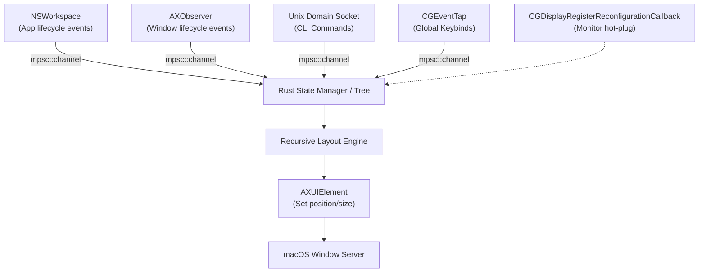
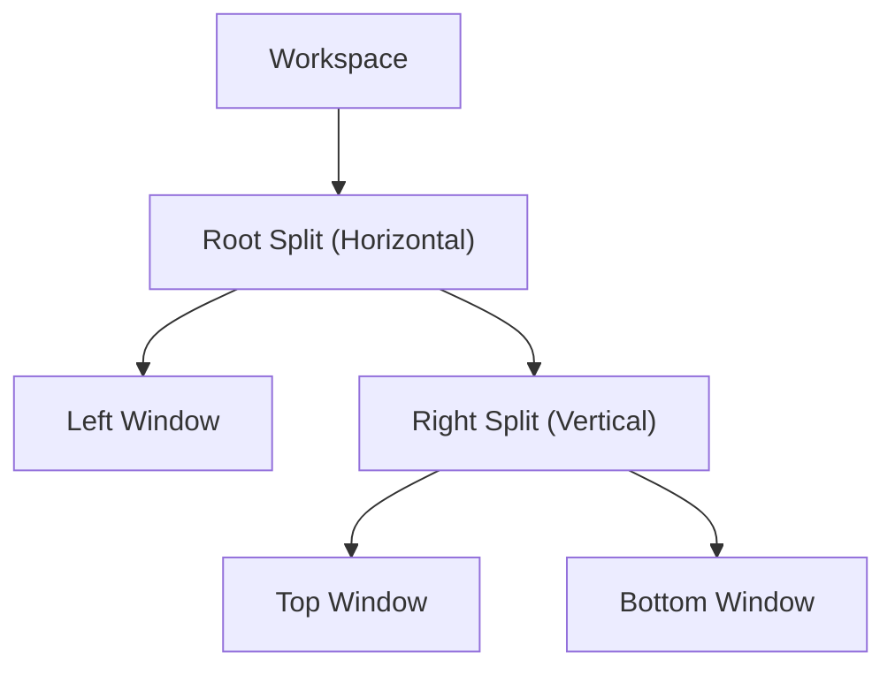

# Window Manager

A tiling window manager for macOS built in Rust. No System Integrity Protection (SIP) disabling required — only public Apple APIs (Accessibility & Core Graphics).

---

## 1. High-Level Architecture

**Core Philosophy:**

- **No SIP Disabling:** Uses only public Apple APIs (`Accessibility` and `Core Graphics`). No private entitlements or kernel extensions.
- **Pure/Dirty Split:** The layout logic is a "pure" Rust mathematical model, completely decoupled from the "dirty" macOS FFI calls. You can unit-test the layout engine on any platform without macOS at all.
- **IPC Model:** A daemon runs in the background listening to macOS events and a Unix Domain Socket (`/tmp/mywm.sock`). A separate CLI client sends JSON/Bincode commands via the socket to control the daemon at runtime.

>[!note] Why UDS instead of TCP?
> Unix Domain Sockets are faster (no TCP stack overhead), more secure (filesystem permissions), and automatically clean up on daemon crash on macOS.

---

## 2. Diagram: The Event Loop & Architecture



The daemon funnels every external event (app launch, window create, monitor change, CLI command) into a single `mpsc::channel`. The state manager pattern-matches on the event type, mutates the arena tree, and triggers a relayout.

---

## 3. The Global View & OS Interop

**The "live view" limitation:**

`AXObserver` is strictly **per-application**. It cannot detect focus changes between apps. There is no global "window list changed" callback.

**The Solution:**

The daemon must:

1. **On startup:** Query `NSWorkspace.shared.runningApplications` to get all running PIDs.
2. **Attach an `AXObserver`** to each application process.
3. **Listen to notifications:**
   - `NSWorkspaceDidLaunchApplicationNotification` — spawn a new `AXObserver` for the newly launched app.
   - `NSWorkspaceDidActivateApplicationNotification` — track which app is frontmost (global focus).
   - `NSWorkspaceDidTerminateApplicationNotification` — clean up the observer and remove orphaned windows.

>[!warning] Accessibility Permissions
> The daemon binary must be listed in **System Settings > Privacy & Security > Accessibility**. Without this, `AXUIElement` calls will silently fail. You must `codesign` the binary with a hardened runtime and the `com.apple.security.cs.disable-library-validation` entitlement.

---

## 4. Core Data Structures: The Arena Tree

The layout tree uses an **ID-based Arena model** to satisfy the Rust borrow checker. Instead of pointer-based parent/child links (which would require `Rc<RefCell<>>` or `unsafe`), every `Node` is stored in a flat `HashMap` and identified by a `NodeId` u64.

```rust
type NodeId = u64;
type WindowId = u64; // AXUIElement's underlying CGWindowID

enum SplitDirection {
    Horizontal,
    Vertical,
}

enum NodeData {
    Window {
        window_id: WindowId,
        is_focused: bool,
    },
    Split {
        direction: SplitDirection,
        ratios: Vec<f32>, // each child's proportional size (sums to 1.0)
    },
}

struct Node {
    id: NodeId,
    parent: Option<NodeId>,
    children: Vec<NodeId>,
    data: NodeData,
}

struct Workspace {
    name: String,
    root: Option<NodeId>,
    nodes: HashMap<NodeId, Node>,
    monitor_id: u32,        // CGDirectDisplayID
    monitor_origin: (i32, i32),
    monitor_size: (u32, u32),
}
```

**Visual representation of a workspace layout:**



---

## 5. Multi-Monitor Setup & Math

**Virtual to physical mapping:**

- A `Workspace` belongs to **exactly one monitor** at a time.
- On macOS, each monitor has its own origin in a **global coordinate space** (e.g., a left display might start at `X = -1920`, a right display at `X = 1920`).

**Coordinate math strategy:**

1. **Local layout math** treats every screen as starting at `(0, 0)`. This keeps the recursive layout engine simple and testable.
2. **Right before FFI execution** (calling `AXUIElementSetAttributeValue`), add the monitor's origin offset to the X/Y coordinates.

```rust
fn screen_local_to_global(
    local_rect: Rect,
    monitor_origin: (i32, i32),
) -> CGRect {
    CGRect {
        x: local_rect.x + monitor_origin.0 as f64,
        y: local_rect.y + monitor_origin.1 as f64,
        width: local_rect.width,
        height: local_rect.height,
    }
}
```

**Hot-plugging:**

- Register a callback via `CGDisplayRegisterReconfigurationCallback`.
- If a monitor is unplugged, its virtual workspaces must be **merged into the primary monitor** to prevent "orphaned" off-screen windows.

>[!warning] Prerequisite: Separate Spaces
> Users **must** enable **System Settings > Desktop & Dock > Displays have separate Spaces**. Without this, macOS treats all monitors as one giant canvas and the coordinate math breaks.

---

## 6. The Layout Algorithm

The recursive layout engine is the "pure" core — no FFI, no macOS types, just `Rect` math.

```rust
#[derive(Clone, Copy, Debug)]
struct Rect {
    x: f64,
    y: f64,
    width: f64,
    height: f64,
}

fn calculate_layout(
    node_id: NodeId,
    bounding: Rect,
    arena: &HashMap<NodeId, Node>,
    output: &mut HashMap<WindowId, Rect>,
    gap_size: f64,
) {
    let node = &arena[&node_id];

    match &node.data {
        NodeData::Window { window_id, .. } => {
            // Base case: subtract gaps and store the final rect
            let inset = Rect {
                x: bounding.x + gap_size,
                y: bounding.y + gap_size,
                width: bounding.width - 2.0 * gap_size,
                height: bounding.height - 2.0 * gap_size,
            };
            output.insert(*window_id, inset);
        }

        NodeData::Split { direction, ratios } => {
            let count = node.children.len();
            for (i, &child_id) in node.children.iter().enumerate() {
                let ratio = ratios.get(i).copied().unwrap_or(1.0 / count as f32);
                let child_rect = match direction {
                    SplitDirection::Horizontal => Rect {
                        x: bounding.x + (i as f64 * bounding.width * ratio as f64),
                        y: bounding.y,
                        width: bounding.width * ratio as f64,
                        height: bounding.height,
                    },
                    SplitDirection::Vertical => Rect {
                        x: bounding.x,
                        y: bounding.y + (i as f64 * bounding.height * ratio as f64),
                        width: bounding.width,
                        height: bounding.height * ratio as f64,
                    },
                };
                calculate_layout(child_id, child_rect, arena, output, gap_size);
            }
        }
    }
}
```

>[!note] Recursion safety
> The tree depth is bounded by the number of splits the user creates (typically < 20). Rust's default stack is 2 MiB, so recursion is safe. For extra safety, you could convert this to an explicit `Vec`-based stack, but that adds complexity for no real-world benefit.

---

## 7. Testing & Release Strategy

**Testing:**

| Layer | What | How |
|-------|------|-----|
| `core/` (pure math) | Layout engine, coordinate math, serialization | `cargo test` in CI — no macOS needed |
| `core/` (parsing) | CLI argument parsing, config file parsing | `cargo test` in CI |
| `daemon/` (FFI) | `AXUIElement` calls, `NSWorkspace` integration | Local macOS VM / Sandbox |
| Integration | Spawn apps, verify window positions | Manual run on real macOS hardware |

**Releases:**

- Binaries must be **code-signed** (`codesign --sign`) to satisfy macOS Accessibility requirements.
- Distribute as a `.dmg` or via Homebrew tap.
- CI pipeline (GitHub Actions on `macos-latest`): build → test → codesign → notarize (`xcrun notarytool`) → staple → publish.

```yaml
# .github/workflows/release.yml (condensed)
jobs:
  release:
    runs-on: macos-latest
    steps:
      - run: cargo build --release
      - run: cargo test
      - run: codesign --force --sign "$IDENTITY" --options runtime target/release/mywmd
      - run: xcrun notarytool submit target/release/mywmd --wait
      - run: xcrun stapler staple target/release/mywmd
```

>[!warning] Notarization is mandatory on macOS 10.15+
> Without notarization, Gatekeeper will block the binary from running on end-user machines. Always staple the ticket so offline verification works.

---

## 8. Project Roadmap

- [ ] **Phase 1 — Core layout engine** (pure Rust, testable on any OS)
- [ ] **Phase 2 — macOS FFI bindings** (`AXUIElement`, `NSWorkspace`, `CGDisplay`)
- [ ] **Phase 3 — Daemon with event loop** (UDS listener + `mpsc` dispatch)
- [ ] **Phase 4 — CLI client** (send commands like `focus right`, `move workspace 2`)
- [ ] **Phase 5 — Multi-monitor** (hot-plug handling, per-monitor workspaces)
- [ ] **Phase 6 — Configuration** (TOML file for keybindings, gaps, layouts)
- [ ] **Phase 7 — Code-signing + notarization** (distribute via Homebrew)
